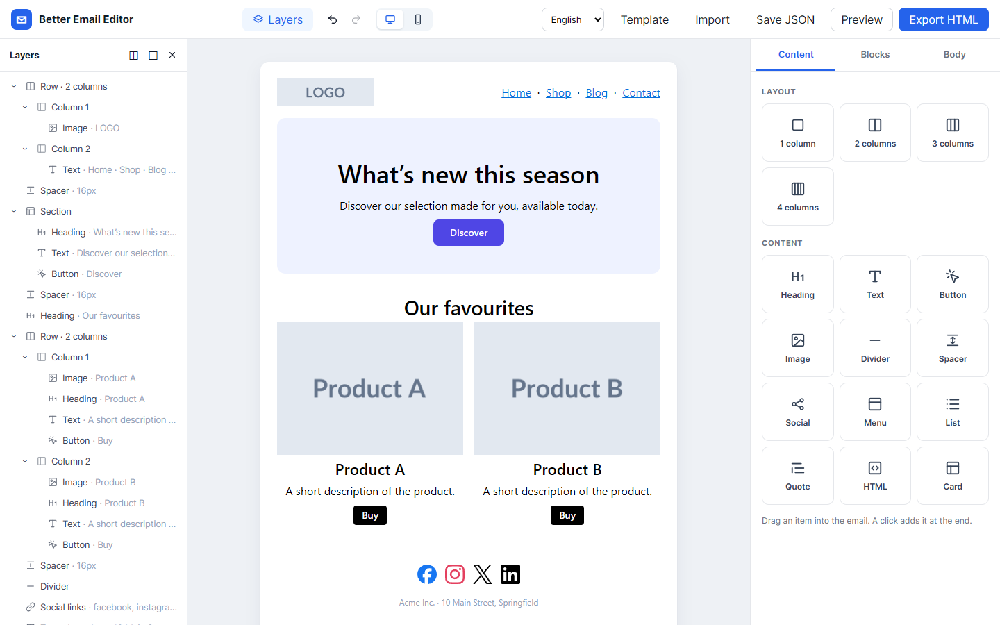
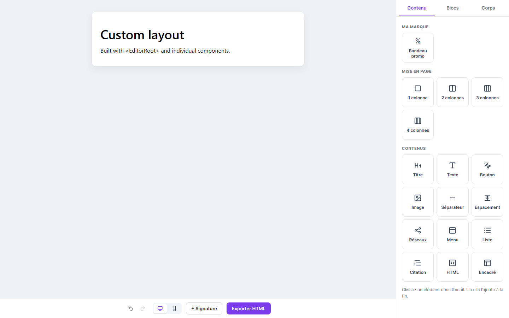

# better-react-email-editor

Un éditeur d'emails en glisser-déposer pour React, dans l'esprit d'[Unlayer](https://unlayer.com). Il s'affiche **dans votre app** (pas d'iframe) et repose sur [`@react-email/editor`](https://www.npmjs.com/package/@react-email/editor) (Tiptap / ProseMirror, avec React Email pour l'export).

Chaque écran et chaque menu est un composant à part. Prenez l'éditeur complet, ou assemblez votre propre mise en page à partir des pièces. Tous les composants acceptent `className` et `style`. L'interface existe en **anglais** (par défaut) et en **français**.

[Read in English](./README.md)



## Fonctionnalités

- **Glisser-déposer** : mises en page de 1 à 4 colonnes et 12 blocs de contenu (titre, texte, bouton, image, séparateur, espacement, réseaux sociaux, menu, liste, citation, HTML, encadré), plus des lignes préfabriquées (en-tête, hero, produits, avantages, témoignage, pied de page).
- **Canvas** : contour au survol et à la sélection, poignée de déplacement, barre d'outils (parent, dupliquer, supprimer) et raccourcis (`Échap` remonte au parent, `Suppr` efface le bloc).
- **Calques** : l'email en arbre. On sélectionne, réordonne et imbrique les blocs par glisser-déposer, et le clavier fonctionne.
- **Propriétés** : un panneau par type de bloc (typographie, marges, fond, bordure, liens, largeur des colonnes, réseaux, HTML…) et un fil d'Ariane de la hiérarchie.
- **Édition du texte** directement dans le canvas, avec menu flottant et commandes `/`.
- **Copier / coller** de blocs et de texte, annuler / rétablir.
- **Aperçu et export** : bureau et mobile, HTML (copier ou télécharger), texte brut et JSON.
- **Modulaire** : on remplace, restyle ou réorganise n'importe quelle partie, et on ajoute ses propres blocs, tuiles, modèles et panneaux.
- **Traductions** : anglais et français fournis, chaque texte est surchargeable.

## Installation

```bash
npm install better-react-email-editor @react-email/editor react-email \
  @tiptap/core @tiptap/pm @tiptap/react @tiptap/html @tiptap/extension-placeholder
```

`react` et `react-dom` (18 ou 19), `@react-email/editor`, `react-email` et les paquets `@tiptap/*` sont des peer dependencies. L'app et l'éditeur doivent partager un seul exemplaire de chacun.

## Démarrage rapide

```tsx
import { BetterEmailEditor } from 'better-react-email-editor';
import '@react-email/editor/themes/default.css';
import 'better-react-email-editor/styles.css';

export function EditeurNewsletter() {
  return (
    <div style={{ height: '100vh' }}>
      <BetterEmailEditor
        locale="fr"
        onChange={(value) => sauvegarder(value)} // { doc, settings }
        uploadImage={async (file) => ({ url: await envoyerSurS3(file) })}
      />
    </div>
  );
}
```

L'éditeur remplit son parent : donnez une hauteur au parent.

### Charger, sauvegarder, exporter

```tsx
const ref = useRef<EmailEditorHandle>(null);

<BetterEmailEditor ref={ref} defaultValue={valeurSauvegardee} onChange={setBrouillon} />;

const value = ref.current.getValue(); // { doc, settings } — à stocker en JSON
ref.current.setValue(autreValeur); // remplace le contenu
const { html, text } = await ref.current.exportEmail(); // email prêt à envoyer
```

| `EmailEditorHandle` | Rôle |
| --- | --- |
| `editor` | L'`Editor` Tiptap sous-jacent. |
| `getValue()` / `setValue(value)` | Lit ou remplace `{ doc, settings }`. `setValue` accepte aussi un document Tiptap seul. |
| `getJSON()` | Le document Tiptap seul. |
| `exportEmail()` | `Promise<{ html, text, unformattedHtml }>`, texte d'aperçu inclus. |
| `getHtml()` / `getText()` | Raccourcis d'`exportEmail()`. |
| `insertBlocks(json[])` | Ajoute des blocs à la fin de l'email. |

`defaultValue` est lu au montage. L'éditeur n'est pas contrôlé, car réappliquer le document à chaque frappe ferait sauter le curseur. Utilisez `setValue` pour remplacer le contenu ensuite.

## Props

`BetterEmailEditor` accepte toutes les props d'`EditorRoot`, plus les props de mise en page listées plus bas.

| Prop | Type | Défaut | Rôle |
| --- | --- | --- | --- |
| `defaultValue` | `EmailValue \| JSONContent` | email vide | Contenu initial, lu au montage. |
| `onChange` | `(value: EmailValue) => void` | | Appelée à chaque modification du document ou des réglages. À débouncer pour une sauvegarde serveur. |
| `onReady` | `(handle) => void` | | Appelée une fois l'éditeur créé. |
| `locale` | `'en' \| 'fr' \| string` | `'en'` | Langue de l'interface. |
| `messages` | `PartialMessages` | | Surcharge des textes, fusionnée avec la langue choisie. |
| `uploadImage` | `(file) => Promise<{ url }>` | data URL | Stockage des images importées ou collées. |
| `nodes` | `NodeDefinition[]` | `defaultNodes` | Types de blocs : libellé, icône, panneau de propriétés, aperçu dans les calques, extensions. |
| `palette` | `PaletteItem[]` | `defaultPalette` | Tuiles de l'onglet **Contenu**. |
| `paletteGroups` | `PaletteGroup[]` | Mise en page, Contenus | Groupes de tuiles. |
| `templates` | `TemplateItem[]` | `defaultTemplates` | Lignes de l'onglet **Blocs**. |
| `starterDocument` | `(i18n) => JSONContent` | email de démo | Chargé par le bouton **Modèle**. |
| `extensions` | `Extensions` | | Extensions Tiptap en plus, lues au montage. |
| `theme` | `EditorThemeInput` | `defaultTheme` | Thème des nouveaux emails, lu au montage. |
| `editable` | `boolean` | `true` | |
| `device` / `defaultDevice` / `onDeviceChange` | `'desktop' \| 'mobile'` | `'desktop'` | Largeur du canvas, contrôlée ou non. |
| `layersOpen` / `defaultLayersOpen` / `onLayersOpenChange` | `boolean` | `true` | Affichage des calques, contrôlé ou non. |
| `className` / `style` | | | Appliqués à l'élément racine. |

Props de mise en page, propres à `BetterEmailEditor` :

| Prop | Rôle |
| --- | --- |
| `showTopBar`, `showLayers`, `showSidebar` | Masquer une partie (toutes à `true` par défaut). |
| `slotProps` | Props de chaque partie, par exemple `{ sidebar: { className: 'ma-sidebar' }, topBar: { actions: <MonBouton /> } }`. |
| `components` | Remplacer une partie : `{ TopBar, LayersPanel, Canvas, Sidebar }`. |

## Composants

Tous acceptent `className` et `style`, et doivent être rendus dans `EditorRoot` (ou `BetterEmailEditor`).

| Composant | Rôle |
| --- | --- |
| `EditorRoot` | Fournisseur : crée l'éditeur et le partage. Rend un `div.bree`. |
| `Canvas` | L'email éditable et son calque (contours, poignée, barre d'outils, indicateur de dépôt). Props : `overlay`, `bubbleMenu`, `slashCommands`. |
| `TopBar` | Barre du haut. Props : `brand`, `actions`, `showLayersToggle`, ou `children` pour remplacer son contenu. |
| `LayersToggle`, `UndoRedo`, `DeviceToggle`, `TemplateButton`, `ImportButton`, `ExportJsonButton`, `PreviewButton`, `ExportHtmlButton` | Les contrôles de la barre, utilisables seuls. |
| `LayersPanel` | Arbre des calques. Props : `title`, `onClose` (`null` masque la croix). |
| `Sidebar` | Panneau de droite. Il bascule entre trois écrans, chacun remplaçable par `renderDocument`, `renderNode` ou `renderText`. |
| `ContentPanel` | Écran affiché quand rien n'est sélectionné : les onglets. La prop `tabs` choisit ou réordonne `'content' \| 'blocks' \| 'body'` et accepte vos propres onglets. |
| `ContentTab` / `PaletteTile` | Palette de tuiles à glisser. |
| `BlocksTab` / `TemplateCard` | Lignes préfabriquées. |
| `BodyTab` | Réglages de l'email : fond, largeur, couleurs par défaut, texte d'aperçu. |
| `PropertiesPanel` | Cadre des propriétés : en-tête, croix, fil d'Ariane. |
| `BlockProperties` | Propriétés du bloc sélectionné, avec le panneau enregistré pour son type. |
| `TextProperties` | Propriétés d'une sélection de texte. |
| `PreviewDialog` | Fenêtre d'aperçu et d'export. |
| `ImageInspector`, `ButtonInspector`, `HeadingInspector`, `SocialLinksInspector`, `ColumnsInspector`, `SpacerInspector`, `HtmlInspector`, `DividerInspector`, `ContainerInspector`, `DefaultInspector` | Panneau de propriétés de chaque type de bloc. |
| `TypographyGroup`, `SpacingGroup`, `BoxGroup` | Groupes de contrôles réutilisables. |
| `Group`, `Field`, `TextInput`, `TextArea`, `NumberInput`, `RangeInput`, `ColorInput`, `Select`, `Segmented`, `AlignInput`, `PaddingInput` | Contrôles de formulaire, pour vos propres panneaux. |

Hooks :

- `useEmailEditor()` donne l'éditeur, `t` (les textes), `locale`, les registres, `device`, `layersOpen`, `settings`, `handle`…
- `useI18n()` donne `{ locale, t }`.
- `useDraggableBlock(label, content)` transforme n'importe quel élément en source de blocs : on le glisse sur le canvas, ou on clique dessus.
- `useDeselect()` vide la sélection.

### Mise en page personnalisée

```tsx
import { EditorRoot, Canvas, Sidebar, UndoRedo, DeviceToggle, ExportHtmlButton } from 'better-react-email-editor';

<EditorRoot locale="fr" defaultValue={value} onChange={sauvegarder} className="mon-editeur">
  <div style={{ display: 'flex', height: '100%' }}>
    <main style={{ flex: 1, display: 'flex', flexDirection: 'column' }}>
      <Canvas style={{ flex: 1 }} />
      <footer>
        <UndoRedo />
        <DeviceToggle />
        <ExportHtmlButton />
      </footer>
    </main>
    <Sidebar style={{ width: 320 }} />
  </div>
</EditorRoot>;
```



Le playground contient cet exemple : `npm run dev`, puis ouvrez `/?example=custom`.

## Style

Toutes les classes commencent par `bree-`, et la feuille de style ne touche à aucun élément global. On restyle une partie avec son `className` ou son `style`, ou tout l'éditeur avec des variables CSS :

```css
.mon-editeur {
  --bree-accent: #7c3aed;
  --bree-accent-hover: #6d28d9;
  --bree-accent-soft: #f5f3ff;
  --bree-font: 'Inter', sans-serif;
  --bree-sidebar-width: 320px;
}
```

Les variables disponibles sont listées dans le [README anglais](./README.md#styling) et en tête de `src/styles.css`. Le sélecteur de couleur est rendu dans un portail : il porte la classe `bree`, donc les variables s'y appliquent aussi, et sa prop `popoverClassName` ajoute votre propre classe.

## Langues

```tsx
<BetterEmailEditor locale="fr" />

// Changer quelques textes
<BetterEmailEditor locale="fr" messages={{ topBar: { brand: 'Acme Mailer' }, palette: { card: 'Bloc info' } }} />

// Ajouter une langue : fournir tous les textes, en partant de `en`
import { en, type Messages } from 'better-react-email-editor';
const de: Messages = { ...en, topBar: { ...en.topBar, preview: 'Vorschau' /* … */ } };
<BetterEmailEditor locale="de" messages={de} />
```

`en` et `fr` sont exportés. `messages` couvre l'interface, le contenu par défaut inséré par la palette et les modèles, les placeholders et les commandes `/`.

## Étendre

Tuile de palette, modèle, panneau de propriétés, nouveau type de bloc ou retrait d'une partie : les exemples de code sont dans la section [Extending du README anglais](./README.md#extending). En bref :

- `palette={[maTuile, ...defaultPalette]}` ajoute une tuile. Son `label` et son `content` reçoivent `{ locale, t }`, ce qui permet de la traduire.
- `templates={[...defaultTemplates, monModele]}` ajoute une ligne préfabriquée.
- `nodes={defaultNodes.map(...)}` remplace le panneau d'un bloc (`inspector`), son icône ou son libellé.
- `nodes={[...defaultNodes, monNoeud]}` ajoute un type de bloc créé avec `EmailNode.create` (voir `src/nodes/custom-nodes.tsx`).
- `content` fournit des helpers pour construire le JSON du document : `paragraph`, `heading`, `button`, `image`, `columns`, `section`, `padding`…

## Développement

```bash
npm install
npm run dev               # playground sur http://localhost:5173 (?lang=fr, ?example=custom)
npm run build             # librairie → dist/ (ESM, CJS, types, styles.css)
npm run typecheck
npm run lint
```

Les scénarios de `scripts/` pilotent le playground en français avec Playwright. Ils utilisent l'Edge installé sur la machine, via `playwright-core`.

```bash
npx vite --port 5179 &
node scripts/e2e.mjs        # idem e2e2 … e2e10, e2e-custom, check-padding — captures dans ./screenshots
```

L'intégration du drag & drop dans ProseMirror et les contournements des limites de `@react-email/editor` sont décrits dans le [README anglais](./README.md#headless-core).
